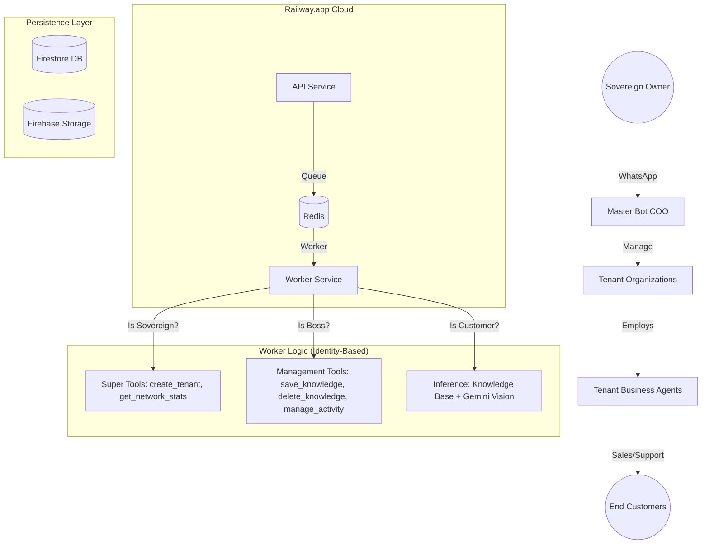

# System Architecture & Tech Stack (Multi-Tenant Sovereign Hierarchy)

## 1. Technology Stack

| Component | Technology | Reasoning |
| :--- | :--- | :--- |
| **Runtime** | **Node.js (v20 LTS)** | Industry standard for high-concurrency event-driven apps. |
| **Language** | **TypeScript** | Strict typing for financials and complex state management. |
| **Web Framework** | **Fastify** | Lowest overhead for webhook ingestion. |
| **Database** | **Firebase Firestore** | Serverless, globally distributed NoSQL over HTTPS. |
| **Storage** | **Firebase Storage** | Persistent archiving for Receipts, Audio, and Products. |
| **Task Queue** | **BullMQ + Railway Redis** | Production-grade managed queue system. |
| **AI Model** | **Gemini 2.5 Flash** | Multimodal (Audio/Vision) support at 1/10th the cost of GPT-4. |
| **Hosting** | **Railway.app (Docker)** | Automated deployments from GitHub with public SSL endpoints. |

## 2. Sovereign Architecture (The Hierarchy of Power)

## 3. Data Model (Final Production)

### `organizations` (Multi-Tenant Config)
*   **Core:** `id`, `name`, `whatsappPhoneId`, `systemPrompt`.
*   **Identity:** `config.adminPhone`, `config.adminPin`, `config.isMaster`.
*   **Financials:** `balance` (Kobo), `subscriptionPlan`, `paymentConfig`.
*   **Knowledge:** Sub-collection `knowledge` (Key-Value facts for AI training).
*   **Activities:** Sub-collection `activities` (Waybills, Bookings, Orders).

### `chats`
*   Doc ID format: `{orgId}_{userPhone}`.
*   Security: `lastAdminAuthAt` tracks the 2-hour PIN session window.

### `transactions` (Replay Protection)
*   Logs verified payments to prevent duplicate receipt usage.

## 4. Operational Workflows (Production)

### 4.1 Zero-Dashboard Training
The Boss trains the bot directly via WhatsApp. 
1.  **Handshake:** Boss enters 4-digit PIN.
2.  **Logic:** Bot uses `save_knowledge` tool to update Firestore.
3.  **Persistence:** Images are archived in Firebase Storage and linked to the Knowledge Base.

### 4.2 Multi-Sector Flexibility
The `manage_activity` tool allows the worker to transition between sectors:
*   **Logistics:** Records Waybills.
*   **Appointments:** Records Bookings.
*   **Retail:** Records Orders.

### 4.4 Decentralized Proactivity (The "COO" Engine)
To prevent the Master Bot from becoming a bottleneck, proactive tasks (Morning Reports/Reminders) are decentralized:
*   **Infrastructure:** A BullMQ Cron Worker triggers a daily job at 8:00 AM for all active Organizations.
*   **Context:** The job is pushed to the `whatsapp-queue` with the specific `orgId`.
*   **Execution:** The Worker process retrieves the Org's unique `adminPhone` and `systemPrompt`, then uses the Client Bot's own identity to message the Boss. This ensures that every bot operates as an independent "Digital COO" within its own rate limits and context.

### 4.5 Financial Integrity (Sovereign Vault)
To ensure the sum of all Tenant Balances equals the Total Network Liability, we use an **Eventual Consistency** model:
1.  **Atomic Deductions:** Tenant balances are updated transactionally.
2.  **Fire-and-Forget Aggregation:** The global vault total is updated optimistically.
3.  **Safety Net:** If the optimistic update fails, the error is logged to `failed_ledger_updates`.
4.  **Reconciliation:** A nightly cron job (`scripts/reconcile-ledger.ts`) audits all tenant balances and corrects any drift in the Sovereign Vault.

## 5. Legacy Components (Deprecated)

### SMS Bridge (Android Relay)
*   **Status:** Deprecated (March 2026).
*   **Replacement:** Vision-First Verification (AI Receipt Analysis) & Direct API Integration.
*   **Reason:** High operational friction and security complexity.
*   **Legacy Support:** The API endpoints (`/bridge/sms`) remain active for existing high-value clients, secured by HMAC-SHA256 signatures. The code has been archived in `legacy_bridge/`.
