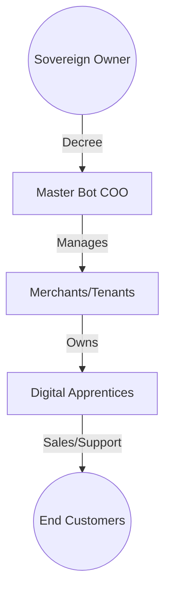

# EMPIRE CORE: The Sovereign Identity (2026)

This document defines the technical, strategic, and financial foundation of the **Naija Agent Empire**. It is the primary source of truth for the platform's existence.

---

## 1. The Core Thesis: Digital Trust Infrastructure
Naija Agent is not a "chatbot." It is **Digital Trust Infrastructure** for the African informal and semi-formal economy.

*   **The Moat:** **Multimodal Native Intelligence.** By understanding Voice Notes (Pidgin/Local Dialects) and reading Image Receipts (Gemini Vision), the agent solves the "Input Friction" and "Verification Fear" better than any global competitor.
*   **The "Billion Euro" View:** You are the **Platform Sovereign**. You don't manage bots; you manage a **Tenant Factory** that spawns bots.

---

## 2. The Sovereign Hierarchy (The Engine)

### Technology Stack
- **Runtime:** Node.js (v20 LTS)
- **Engine:** BullMQ + Railway Redis (Parallel Dispatching)
- **Brain:** Gemini 2.5 Flash (Multimodal Vision/Audio)
- **Database:** Firebase Firestore (Multi-Tenant O(1) Isolation)
- **Back-Office:** Next.js 15 (Hybrid Hub Dashboard)

### The Hierarchy of Power

---

## 3. Universal DNA (Sector Agnostic)
Every bot in the empire possesses three critical pillars that allow it to dominate any sector:

1.  **The State Machine Engine:** Tracks the "Lifecycle" of a request (Waybill, Order, or Booking).
2.  **The Financial Guard:** Verifies payments via Vision OCR and Official Bank APIs (Iron Shield).
3.  **Identity-Based RBAC:** Isolates powers between the Boss, Staff, and Customers.

### Core Sectors
- **Retail:** Focus on "Fake Alert Busting" and instant pricing.
- **Logistics:** Focus on waybill generation and rider accountability.
- **Appointments:** Focus on 24/7 availability and commitment fee gatekeeping.

---

## 4. Monetization: The AI Credits Model
We treat AI interactions like **GSM Airtime**. Revenue is prepaid, high-margin, and collected upfront.

### Pricing Strategy (The Kobo Standard)
- **Customer Text Reply:** ~₦33 (Cost: ~₦2).
- **Customer Image/Audio:** ~₦77 (Cost: ~₦5).
- **Verification Tool:** ~₦100 (Premium for bank integration).
- **Admin Mode:** Always **FREE** for the Boss.

### The Viral Loop
Every bot reply appends a nudge: *"Want your own AI Agent? Chat with our Master."* Every interaction is a sales pitch for the Sovereign.

---

## 5. Operational Principles
- **Bi-Directional Verification:** Trust but verify. Use Vision first for speed, then Bank API for high-value transactions.
- **Proactive COO:** Bots do not wait; they ping. (Morning Reports, Low-Balance Alerts, Stock Reminders).
- **Zero-Friction Onboarding:** Transitioning to "Snap Your Price List" training via Vision.
- **Hybrid Hub:** Action lives on WhatsApp; Auditing/Management lives on the Web Dashboard.
